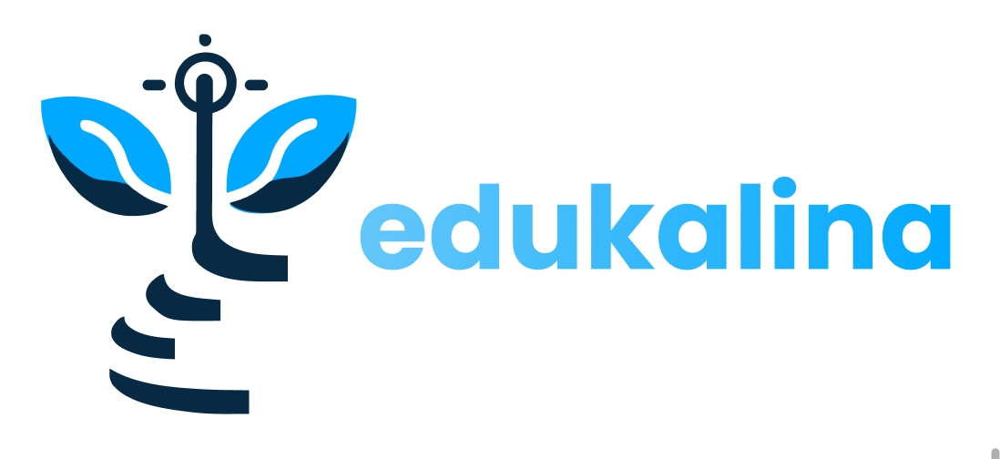
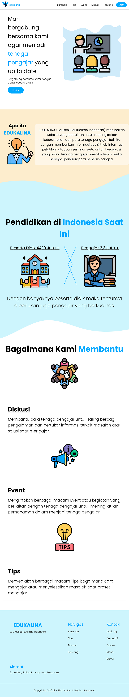

# About Edukalina
Pendidikan adalah salah satu sektor kunci dalam membangun suatu negara.
Sistem pendidikan yang kuat dan efisien sangat penting dalam melahirkan generasi
muda yang terampil dan siap bersaing di era globalisasi.
Dengan latar belakang ini, pengembangan sistem tenaga pengajar berbasis
website “EDUKALINA” dapat menjadi solusi yang efektif untuk membantu tenaga
pengajar untuk meningkatkan kualitas diri agar dapat membantu para
generasi penerus bangsa agar menjadi terampil dan siap bersaing di era
globalisasi. Website “EDUKALINA” memiliki tiga fitur utama yang mendukung peningkatan kualitas 
tenaga pengajar, yaitu tips, event dan diskusi.

# Demo

Silahkan Kunjungi website kami : [EDUKALINA](https://edukalina.netlify.app// "Edukalina").

# Team

Team ID : C523-PS039

Anggota Kelompok :

- F278YA194 – Muh. Dadang Hawari
- F635YA187 – Aryandhi Alhaqam Patompo
- F253YA254 – Moh. Azzam Al Husaini
- F253YA258 – Mario Alfredo Bawu
- S253YA462 – Rama Indrawan

# Screenshots

## Beranda

## Tips

## Event

## Diskusi

## Tentang Kami

